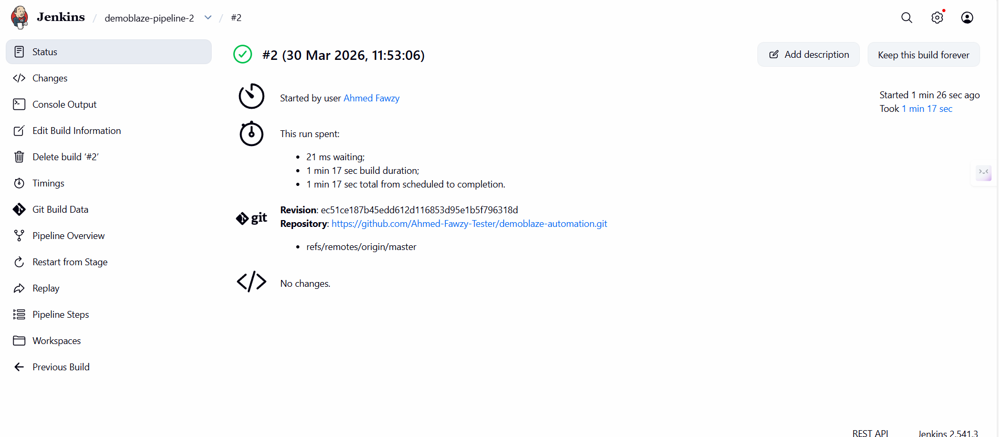

# Demoblaze Automation Project

Automated end-to-end testing project for the Demoblaze website using **Java, Selenium WebDriver, TestNG, Maven, Docker, Selenium Grid, and Jenkins**.

This project demonstrates a full UI automation workflow, starting from test development to containerized execution and CI pipeline integration.

---

## Project Overview

This project automates a basic e-commerce flow on the **Demoblaze** website:

- Open the website
- Select a product
- Add the product to cart
- Accept the alert
- Navigate to the cart page
- Verify the product is visible in the cart

The project is designed to show practical skills in:

- UI test automation
- Page Object Model (POM)
- Selenium Grid
- Dockerized test execution
- Jenkins CI/CD integration

---


## Tech Stack

- **Java**
- **Selenium WebDriver**
- **TestNG**
- **Maven**
- **Docker**
- **Docker Compose**
- **Selenium Grid**
- **Jenkins**
- **Git & GitHub**

---

## Framework Design

This project follows the **Page Object Model (POM)** design pattern for better readability, maintainability, and scalability.

### Main Components

- **Pages**
  - Contains page classes and locators
  - Example: homepage actions, product page actions, cart page verification

- **Utils**
  - Handles WebDriver setup and browser configuration

- **Tests**
  - Contains the test classes and test scenarios

---

## Project Structure

```text
demoblaze-automation/
├── src/
│   ├── main/java/
│   │   ├── pages/
│   │   └── utils/
│   └── test/java/
│       └── tests/
├── screenshots/
├── Dockerfile
├── Dockerfile.jenkins
├── docker-compose.yml
├── Jenkinsfile
├── pom.xml
└── README.md
```
---

### Screenshots



---


### 👨‍💻 Author

**Ahmed Fawzy**
QA Automation Engineer | DevOps Enthusiast
www.linkedin.com/in/ahmed-f-188302225

---

### ⭐ If you like this project

Give it a star ⭐ on GitHub!
